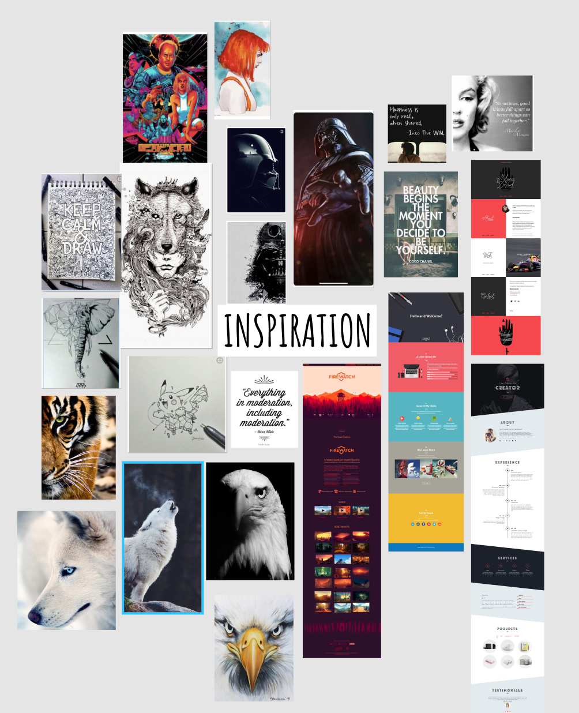
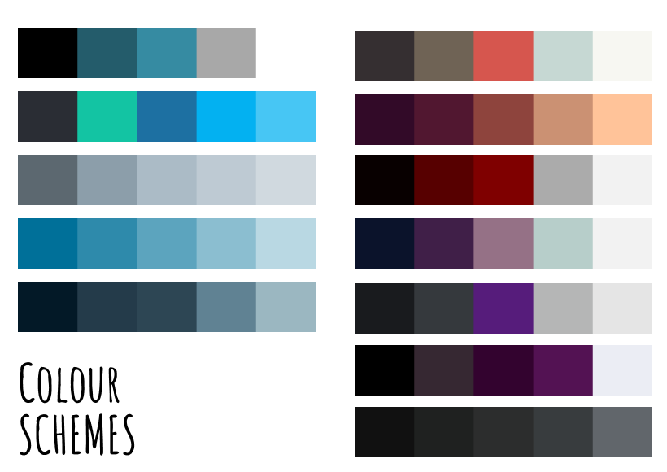
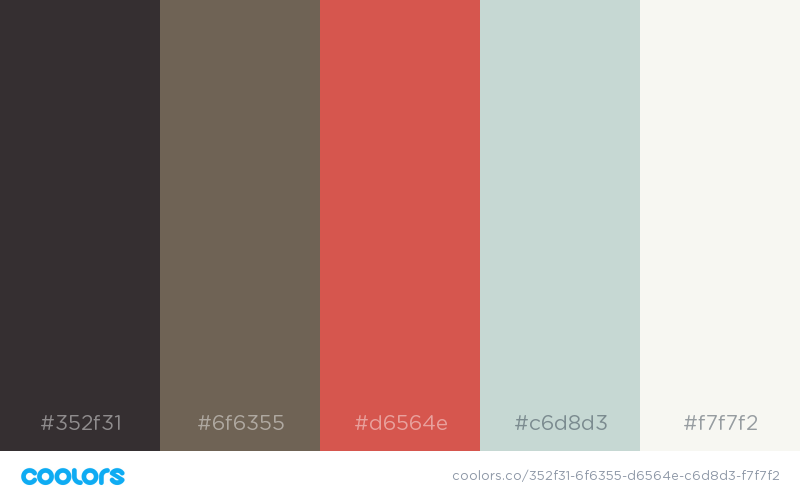
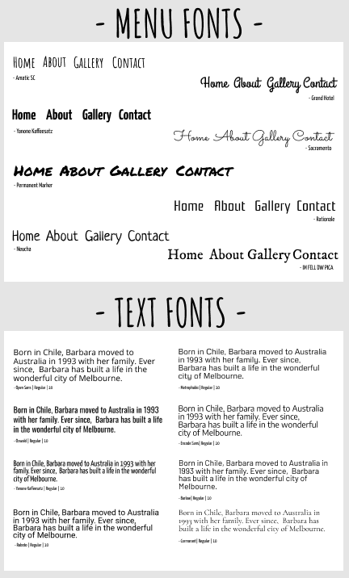
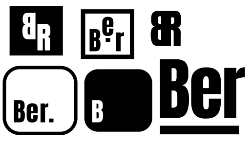
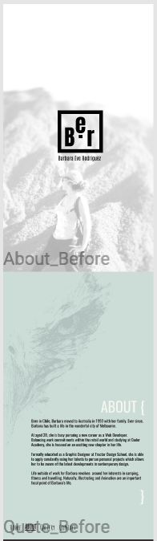
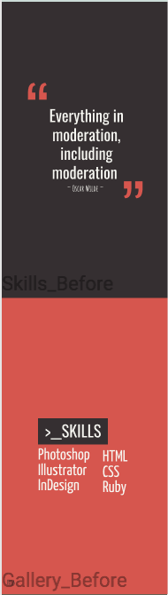
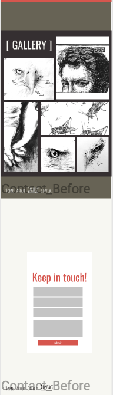
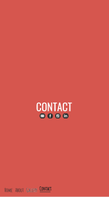

# **Portfolio Assignment**
*~ by Barbara Rodriguez ~*

Website:
https://barbararodriguez.netlify.com

## **The Design Process**
***

### **Aim**
The aim of my portfolio is to reflect my persona as a professional individual, utilising my graphic design skills, and developing programming skills.

The desired outcome needs to reflect the following attributes:
- User Experience
    -  Easy to navigate
    -  Simple
- User Interface 
    - Clean
    - Neutral colours
    - Modern

- Typography
    - Sans-serif
    - 3 fonts (max)
    - Quirky (Headers)

- Colour Schemes
    - Complimentary colours
    - Inspired by interests *(posters, movies, illustrations etc)*

### **Screenshots:**
***

**Inspiration** <----------

My inspiration came from various interests which include illustrators such as [Kerby Rosanes](http://kerbyrosanes.com), movies *(Star Wars, The Fifth Element)*, Spirit Animals *(Bald Eagle, Wolves, Tigers)*, Quotes, and One-page mobile designs.

>

**Colour Schemes** <----------

As mentioned earlier, the colour schemes I desired were subtle/neutral whilst being complimentary.

The colour schemes chosen were inspired by the movie posters from *'Star Wars'* and the *'The Fifth Element'*.

The colour schemes came from [Coolers](https://coolors.co).

>

My chosen colour scheme were:

>

**Fonts** <----------

The fonts chosen for my design needed to be sans-serif, clean, more than 2 fonts in a font-family, and can be used in multiple browsers.

I downloaded my font kits from [Font Squireel](https://www.fontsquirrel.com).

>

**Logo** <----------

When designing the logo, I wanted to keep it simple and black and white.

>

**Wireframes** <----------

The foundations for a great website is solid wireframes. 

I took the time to carefully layout my design - one page at a time.

I wanted to keep a clean, one-page mobile website design to emphasize more on the subtle details such as type, use of negative space and create a dynamic feel.

>
>
***
## **The Development Process**
***

Just with any design, I've encountered some issues within multiple pages.

The major ones:

- Responsive design with desktop
- Navigations
- Layering (Parallax)
- Images loading in Gallery
- Hover effects

Most of these issues were tweaked to function as best as they can within the mobile interface. Some were unresolved but have served as a learning experience for future development.

The challenging aspects of design was to get the layout to respond smoothly with the desktop environment. The *'Parallax'* theme was difficult to work with - but fun at the same time.

What was exciting to work with was with new css styles that weren't available two years ago when I was working on responsive website design.

Although not used in this project, the introduction to new tools such as 'css-grid' has open the doors to the front-end development professionals.

I'm looking forward to working more with css in the future and see what interesting and exciting projects I can develop.

